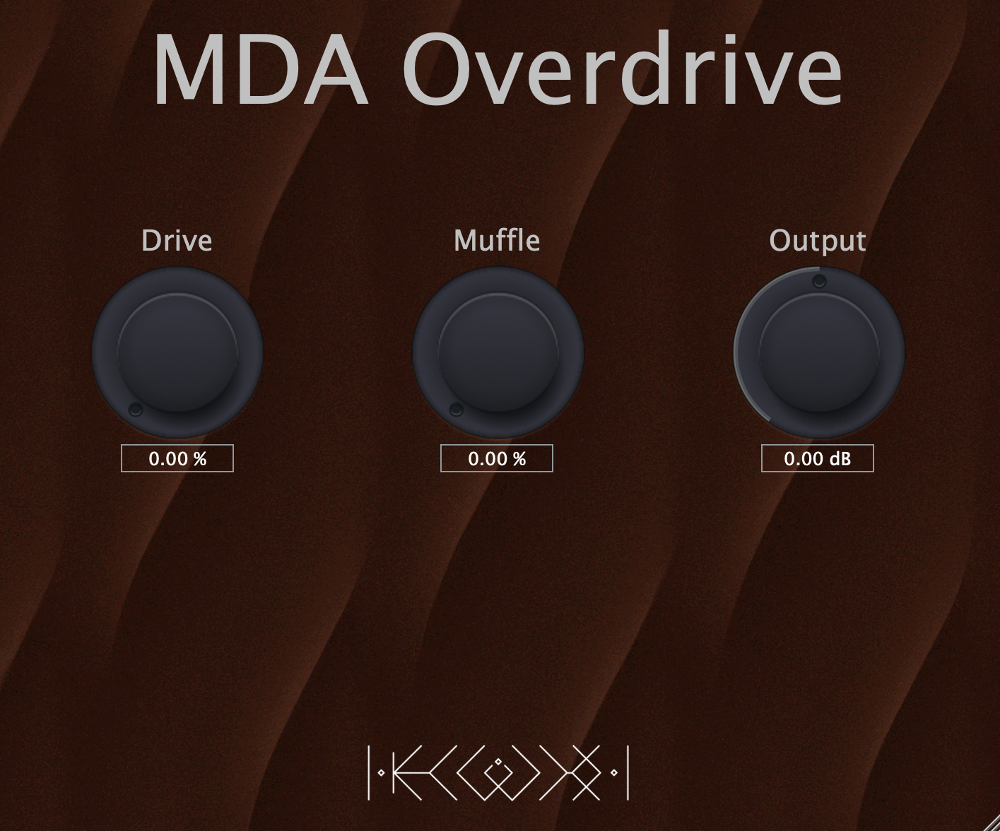

Implementation of the plug-in <b> MDA Overdrive </b>, which is a soft-overdive from the open source MDA Suite.
The software is coded in the Juce framework using C++.

The plug-in has the following parameters:

- <b>Drive</b>: amount of distortion, 0 – 100%
- <b>Muffle</b>: gentle low-pass filter, 0 – 100%
- <b>Output</b>: level trim, –70 dB to +20 dB

The user interface has been realised using the juce module <b>foleys_gui_magic</b>.

### References

- Audio Programming: https://audiodev.blog/mda-overdrive/
- GUI: https://github.com/ffAudio/foleys_gui_magic/
